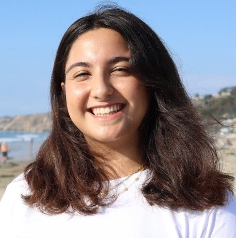

<a name="start-anchor-point"></a>
# Katherine Charry
## *Hello World!*


**Github:** [github.com/kcharry](https://github.com/kcharry) \
**LinkedIn:** [linkedin.com/in/kacharry](https://www.linkedin.com/in/kacharry/)

My name is Katherine and I am an aspiring software engineer pursuing a B.S. 
in Computer Science with a minor in Biology at UC San Diego. I’m passionate 
about developing software that solve real-world problems, and supports 
communities.

I enjoy diving into complex problems and learning new tools and frameworks along
the way. Most recently, I’ve been working on a primer design web tool in 
Professor Sahoo’s Boolean Lab at UCSD, as well as developing a website for the 
fashion-tech startup Runway Avenue to boost visibility and improve connections 
with users, vendors, and potential investors. I enjoy collaborating with 
diverse teams and building high-performance, user-focused solutions. 
Here are some of the projects I've worked on!

### Projects
1. **ERSP Split-LAMP Primer Design Site:** [Github](https://github.com/vsantiago-ucsd/ESRP_Split-LAMP_Primer_Design_Tool)
2. **Runway Avenue Launchpad:** [Github](https://github.com/CSES-Dev/runway-ave)
3. **Autumn Moon Festival Site:** [Github](https://github.com/alanttran/autumnmoon) - [View Project](https://alanttran.github.io/autumnmoon/)
4. **Solanum:** [Github](https://github.com/acmucsd-projects/wi25-hack-team-2) - [View Project](https://alanttran.github.io/autumnmoon/)

Outside of coding, I enjoy going to the beach, catching a concert, playing volleyball, 
or gaming with friends. I also love staying engaged with my community thorugh 
various clubs and orgs!

### Clubs/Orgs.
- **CSE-PACE** Lead Peer Mentor 
- **Association for Computing Machinery** Outreach Logistics Lead 
- **Women In computing** General Member

This summer I'm super excited to be interning at Microsoft as a Software 
Development Explore Intern in Redmond 😆! Although, with my start 
date approaching, I have been feeling a bit of imposter syndrome and fear that I 
won't be able to perform well. Thoughts like: 
>*Why me? I just got lucky.... Can I even code!?!?!?* 

flood my brain. But I have to remind myself that I was chosen for a reason and 
can excel at anything if I put my mind to it! To take my control of my situation, 
I also made a checklist for this quarter: 
- [ ] take cse110 (in progress...)
- [ ] partcipate in a hackathon 
- [ ] talk to profs. in office hours for advice on being a successful intern
- [ ] keep practicing and honing my skills through current projects


My fav code joke:
```
def understand_recursion():
    return understand_recursion()
```

[README file](README.md) | [*Return to top*](#katherine-charry)


